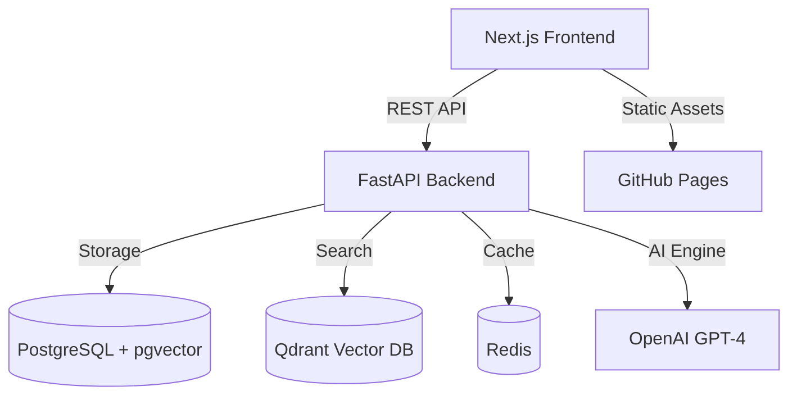

# LegacyLink ✦
### *We can't stop death. But we can stop being forgotten.*

[](https://github.com/DEMONx07/Legacy-Link/actions/workflows/deploy.yml)

> **Digital immortality platform** — Record a lifetime of stories. Create interactive AI avatars from a person's memories, personality, and voice. Future generations can have real conversations with the people they loved.

---

## 🌐 Live Demo
The frontend is hosted on GitHub Pages:
**[https://DEMONx07.github.io/Legacy-Link/](https://DEMONx07.github.io/Legacy-Link/)**

*Note: The live demo showcases the UI and 3D avatar animations. Interactive AI features require the backend services to be running locally or on a private server.*

---

## 🚀 Quick Start — Local Development

### 1. Prerequisites
- **Docker & Docker Compose**
- **Node.js 20+** (for frontend development)
- **Python 3.11+** (for backend development)

### 2. Launch with Docker (Recommended)
```bash
# Clone the repository
git clone https://github.com/DEMONx07/Legacy-Link.git
cd Legacy-Link

# Setup environment
cp legacylink/.env.example legacylink/.env

# Launch everything
cd legacylink
docker-compose up --build
```
- **Frontend**: [http://localhost:3000](http://localhost:3000)
- **API Backend**: [http://localhost:8000/api/health](http://localhost:8000/api/health)
- **Vector DB (Qdrant)**: [http://localhost:6333/dashboard](http://localhost:6333/dashboard)

---

## ✨ Features

- **Interactive AI Avatars**: Real-time conversations with "digital descendants" powered by GPT-4 and RAG.
- **3D Emotion-Reactive UI**: A custom Three.js animated orb that reacts to conversation sentiment.
- **Voice Intelligence**: WebRTC recording with local or cloud-based transcription.
- **Memory RAG Engine**: Retrieval-Augmented Generation to fetch relevant life stories during chat.
- **Persona-Driven Design**:character-specific themes for Grandma Ruth, Grandpa Joe, and Uncle Bob.
- **Zero-Inline CSS**: Fully optimized frontend using static persona classes for maximum performance.

---

## 🏗 Architecture



### Tech Stack
- **Frontend**: Next.js 14, TypeScript, TailwindCSS, Framer Motion, Three.js
- **Backend**: FastAPI (Python 3.11), SQLAlchemy
- **Data Layers**: PostgreSQL (Structured), Qdrant (Vector), Redis (Cache)
- **CI/CD**: GitHub Actions (Next.js Static Export)

---

## 📁 Project Structure

```
Legacy-Link/
├── .github/workflows/       # GitHub Actions (Auto-Deploy)
├── legacylink/              # Core Application
│   ├── frontend/            # Next.js 14 Web App
│   ├── backend/             # FastAPI / Python API
│   ├── demo/                # Sample Persona Data
│   └── docker-compose.yml   # Orchestration
└── .vscode/                 # IDE Configuration
```

---

## 🔑 AI Configuration (Optional)
LegacyLink runs in **Demo Mode** by default. To enable true AI personality simulation, update `legacylink/.env`:
```env
OPENAI_API_KEY=sk-...
DEMO_MODE=false
```

---

## 🤝 Contribution & Maintenance
This project has been optimized with a "Linter-Clean" policy. 
- All CSS is strictly class-based in `globals.css`.
- Dynamic routes use `generateStaticParams` for static export compatibility.

---

*Built for the future of human legacy.*
